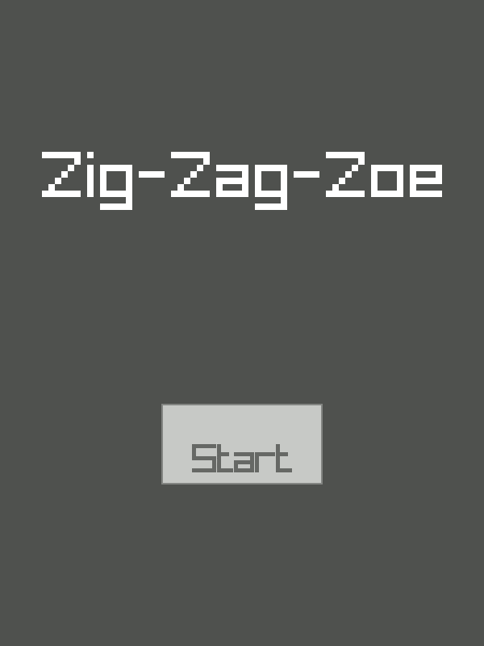

# Zig-Zag-Zoe
Tic-tac-toe TUI/GUI game written in Zig

# Features
* TUI Interface

* GUI Interface

* Local PvP
* CPU players with adjustable difficulty
    * Bots can play against other bots, too!

# How To Run
NOTE: There is a one second delay between moves when both players are bots. This
is so their moves are visible. Otherwise, the game finishes instantly

## From Releases
Just run the file like you normally would from your command line.

## From Source
You should be able to simply type `zig build run`. If there are any errors about
missing "vaxis", then run `zig fetch --save git+https://github.com/rockorager/libvaxis`,
and that should add it or something, idk.

Same goes for "raylib-zig", `zig fetch --save https://github.com/Not-Nik/raylib-zig/archive/devel.tar.gz`
and you should be good to go.

`zig build run` for TUI mode. `zig build -Dgui run` for GUI mode

# How To Play
## TUI
Move around using WASD, the arrow keys, hjkl, or the keypad arrows (make sure
numlock is off).

Press enter, space, or keypad enter to select.

The game can be quit at any time by pressing escape or Ctrl-C

## GUI
Click on buttons and squares with your mouse. Note that the game is 600x800
resolution, so make sure your monitor is >= 800 pixels high

The game can be quit at any time by pressing escape or the x button at the top
of the window

# Dependencies
1) [Zig](https://ziglang.org/)
2) [Libvaxis](https://github.com/rockorager/libvaxis)
3) [Raylib-Zig](https://github.com/Not-Nik/raylib-zig)
